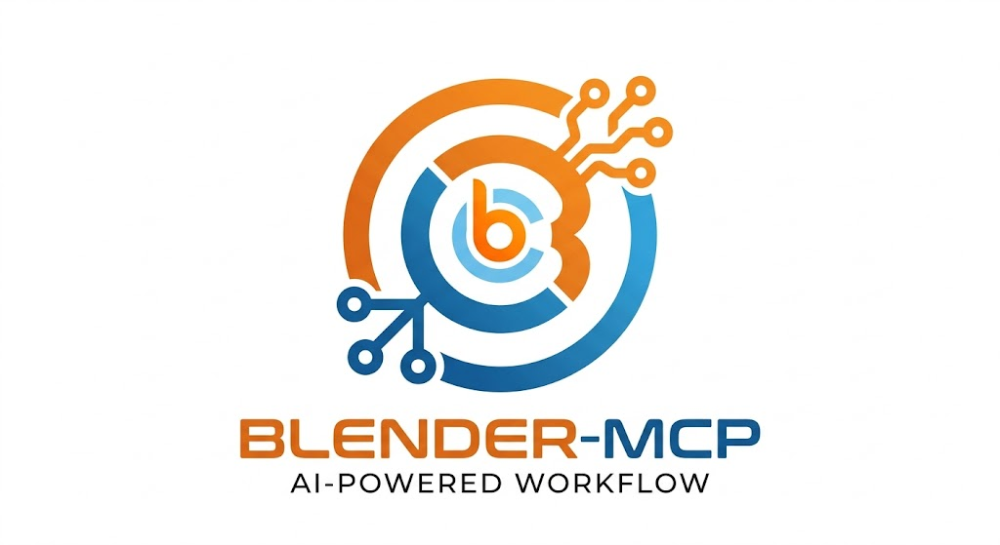

<p align="center">
  
</p>
<p align="center">
  <strong>Control Blender with AI through the Model Context Protocol</strong>
</p>

<p align="center">
  <a href="https://github.com/harveyxiacn/blender-mcp/actions"></a>
  <a href="https://pypi.org/project/blender-mcp/"></a>
  <a href="https://pypi.org/project/blender-mcp/"></a>
  <a href="LICENSE"></a>
  <a href="https://github.com/harveyxiacn/blender-mcp/issues"></a>
  <a href="https://github.com/harveyxiacn/blender-mcp/discussions"></a>
</p>

<p align="center">
  <a href="#quick-start">Quick Start</a> •
  <a href="docs/en/ARCHITECTURE.md">Architecture</a> •
  <a href="docs/en/API_REFERENCE.md">API Reference</a> •
  <a href="docs/en/CONTRIBUTING.md">Contributing</a> •
  <a href="https://github.com/harveyxiacn/blender-mcp/discussions">Discussions</a> •
  <a href="#中文">中文</a>
</p>

---

## Overview

Blender MCP is an open-source [Model Context Protocol](https://modelcontextprotocol.io/) server that lets AI assistants control [Blender](https://www.blender.org/) through natural language. It works with any MCP-compatible client — **Cursor**, **Windsurf**, **Claude Desktop**, and more.

The project consists of two components:
- **MCP Server** (`src/blender_mcp/`) — a FastMCP server exposing Blender operations as MCP tools
- **Blender Addon** (`addon/blender_mcp_addon/`) — a Blender plugin that receives commands over TCP and executes them via Blender's Python API

```
AI Client (Cursor / Windsurf / Claude Desktop)
    ↓  MCP protocol (stdio or HTTP)
Blender MCP Server (Python, FastMCP)
    ↓  TCP JSON messages (localhost:9876)
Blender Addon (runs inside Blender)
    ↓  Blender Python API (bpy)
Blender
```

## Gallery

> All renders below were generated entirely through AI commands using Blender MCP — no manual Blender interaction.

| Anime Character Trio | Fantasy Warrior |
|:---:|:---:|
|  |  |

| Style Preview | Action Pose |
|:---:|:---:|
|  |  |

## Key Features

- **359 MCP tools** across 51 modules — modeling, materials, animation, rendering, rigging, and more
- **Smart skill loading** — default `skill` profile starts with 32 tools; 12 skill groups activate on demand to keep AI context lean
- **6 profiles** — from `minimal` (29 tools) to `full` (356 tools)
- **Visual feedback** — `blender_snapshot_viewport` and `blender_snapshot_render_preview` for multimodal AI review loops
- **Checkpoint system** — named save/restore points before risky operations
- **Style system** — 8 rendering style presets from Pixel Art to AAA
- **67 procedural materials** — metals, woods, stones, fabrics, nature, skin, effects, toon
- **Quality audit** — topology, UV, and performance validation
- **Blender 4.x / 5.x** compatible
- **Multi-IDE support** — Cursor, Windsurf, Claude Desktop, and any MCP client

## Quick Start

### Prerequisites

- **Python 3.10+**
- **Blender 4.0+**
- **[uv](https://docs.astral.sh/uv/)** (recommended) or pip
- An MCP-compatible client

### Install & Run

```bash
git clone https://github.com/harveyxiacn/blender-mcp.git
cd blender-mcp
uv sync

# Build the Blender addon
python build_addon.py

# Start the MCP server
uv run blender-mcp
```

Or install from PyPI:

```bash
pip install blender-mcp
blender-mcp
```

### Set Up Blender

1. Open Blender → `Edit` → `Preferences` → `Add-ons` → `Install...`
2. Select `dist/blender_mcp_addon.zip`
3. Enable **Blender MCP**
4. Open the **MCP** panel in the 3D View sidebar

### Configure Your IDE

Add to your MCP client config:

```json
{
  "mcpServers": {
    "blender": {
      "command": "uv",
      "args": ["run", "--directory", "/path/to/blender-mcp", "blender-mcp"]
    }
  }
}
```

## Tool Profiles

| Profile | Tools | Use Case |
|---------|-------|----------|
| `minimal` | 29 | Core scene/object/utility/export only |
| `skill` | 32 | **Default** — core + on-demand skill loading |
| `focused` | 108 | Curated workflow set |
| `standard` | 165 | Broader daily-use coverage |
| `extended` | 194 | Adds physics & batch operations |
| `full` | 356 | Everything |

## Skill System

With the default `skill` profile, only core tools load at startup. AI activates additional groups on demand:

```
blender_list_skills         → see all 12 available skill groups
blender_activate_skill      → load a group's tools dynamically
blender_deactivate_skill    → unload to free AI context
```

Skills include: `modeling`, `materials`, `style`, `character`, `animation`, `scene_setup`, `automation`, `physics`, `batch_assets`, `advanced_3d`, `sport_character`, `training`.

## Documentation

All documentation is available in **English** and **中文 (Chinese)**.

| Document | English | 中文 |
|----------|---------|------|
| Quick Start | [QUICKSTART](docs/en/QUICKSTART.md) | [快速开始](docs/zh/QUICKSTART.md) |
| Installation | [INSTALLATION](docs/en/INSTALLATION.md) | [安装指南](docs/zh/INSTALLATION.md) |
| Architecture | [ARCHITECTURE](docs/en/ARCHITECTURE.md) | [架构设计](docs/zh/ARCHITECTURE.md) |
| API Reference | [API_REFERENCE](docs/en/API_REFERENCE.md) | [API 参考](docs/zh/API_REFERENCE.md) |
| Skill System | [MCP_SKILL_SYSTEM_GUIDE](docs/en/MCP_SKILL_SYSTEM_GUIDE.md) | [Skill 系统指南](docs/zh/MCP_SKILL_SYSTEM_GUIDE.md) |
| Tutorials | [TUTORIALS](docs/en/TUTORIALS.md) | [教程](docs/zh/TUTORIALS.md) |
| Contributing | [CONTRIBUTING](docs/en/CONTRIBUTING.md) | [贡献指南](docs/zh/CONTRIBUTING.md) |
| Changelog | [CHANGELOG](docs/en/CHANGELOG.md) | [更新日志](docs/zh/CHANGELOG.md) |
| Roadmap | [ROADMAP](docs/en/ROADMAP.md) | [路线图](docs/zh/ROADMAP.md) |
| Security | [SECURITY](SECURITY.md) | [安全策略](docs/zh/SECURITY.md) |
| Code of Conduct | [CODE_OF_CONDUCT](CODE_OF_CONDUCT.md) | [行为准则](docs/zh/CODE_OF_CONDUCT.md) |

## Community

- **[GitHub Discussions](https://github.com/harveyxiacn/blender-mcp/discussions)** — questions, ideas, show & tell
- **[Issues](https://github.com/harveyxiacn/blender-mcp/issues)** — bug reports and feature requests
- **[Contributing Guide](docs/en/CONTRIBUTING.md)** — how to add tools, fix bugs, improve docs

## Contributing

We welcome contributions! Please see [CONTRIBUTING.md](docs/en/CONTRIBUTING.md) for guidelines.

1. Fork the repo & create a feature branch
2. Install dev dependencies: `uv sync --all-extras`
3. Make changes and add tests
4. Run checks: `pytest && ruff check src/ && black --check src/`
5. Submit a pull request

## Security

For security concerns, please see [SECURITY.md](SECURITY.md). Do **not** open a public issue for security vulnerabilities.

## Known Caveats

- `pipeline` and `quality_audit` tools are **experimental** — addon handlers are still in progress
- If `.venv` breaks after copying the repo to another machine, delete `.venv` and re-run `uv sync`

## License

[MIT](LICENSE) — Copyright (c) 2024-2026 Blender MCP Contributors

---

## 中文

### 概述

Blender MCP 是一个开源的 [Model Context Protocol](https://modelcontextprotocol.io/) 服务器，让 AI 助手可以通过自然语言控制 [Blender](https://www.blender.org/)。支持 **Cursor**、**Windsurf**、**Claude Desktop** 等任意 MCP 兼容客户端。

### 展示

> 以下所有渲染结果完全通过 AI 命令生成，无需手动操作 Blender。

| 动漫角色三人组 | 奇幻战士 |
|:---:|:---:|
|  |  |

### 核心特性

- **359 个 MCP 工具**，覆盖建模、材质、动画、渲染等全流程
- **智能工具加载** — 默认 `skill` 配置仅加载 32 个工具，12 个技能组按需激活
- **6 种配置方案** — 从 `minimal`（29 个工具）到 `full`（356 个工具）
- **视觉反馈** — 视口截图 + 渲染预览，支持多模态 AI 审查循环
- **检查点系统** — 高风险操作前的命名存档/还原点
- **风格系统** — 8 种渲染风格预设（像素风到 3A 级）
- **67 种程序化材质** — 金属、木材、石材、布料、自然、皮肤、特效、卡通
- **质量审计** — 拓扑、UV、性能验证
- **兼容 Blender 4.x / 5.x**

### 快速开始

```bash
git clone https://github.com/harveyxiacn/blender-mcp.git
cd blender-mcp
uv sync

# 打包 Blender 插件
python build_addon.py

# 启动 MCP 服务器
uv run blender-mcp
```

或通过 pip 安装：

```bash
pip install blender-mcp
blender-mcp
```

然后在 Blender 中：

1. `编辑` → `偏好设置` → `插件` → `安装...`
2. 选择 `dist/blender_mcp_addon.zip`
3. 启用 **Blender MCP**
4. 在 3D 视图侧边栏打开 **MCP** 面板

IDE 配置：

```json
{
  "mcpServers": {
    "blender": {
      "command": "uv",
      "args": ["run", "--directory", "/path/to/blender-mcp", "blender-mcp"]
    }
  }
}
```

### 社区

- **[GitHub Discussions](https://github.com/harveyxiacn/blender-mcp/discussions)** — 提问、讨论、展示作品
- **[Issues](https://github.com/harveyxiacn/blender-mcp/issues)** — 问题反馈与功能建议

### 文档

所有文档均提供 **English** 和 **中文** 版本，详见上方[文档表格](#documentation)。

### 系统要求

- Python 3.10+
- Blender 4.0+
- 任意兼容 MCP 的客户端

### 许可证

[MIT](LICENSE) — Copyright (c) 2024-2026 Blender MCP Contributors
